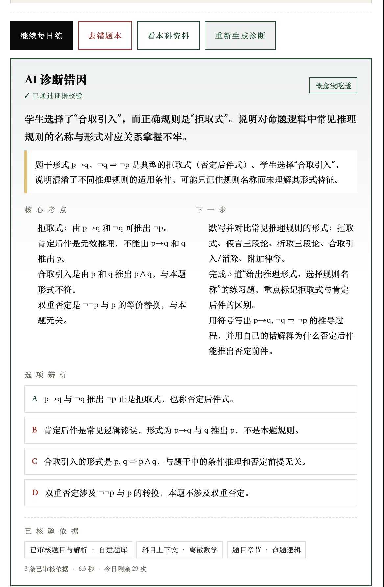
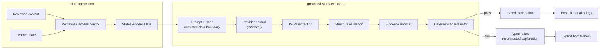

# grounded-study-explainer

[English](./README.md) · [简体中文](./README.zh-CN.md)

[](https://github.com/agnostic-ap/grounded-study-explainer/actions/workflows/ci.yml)
[](https://github.com/agnostic-ap/grounded-study-explainer/releases)
[](./LICENSE)

Provider-neutral TypeScript primitives for generating, parsing, validating, and deterministically evaluating evidence-grounded study explanations.

The core rule is deliberately strict: a model may cite only stable evidence IDs supplied by the host. Malformed output, unknown citations, or missing uncertainty boundaries become typed failures instead of user-visible explanations.

## Production integration example

The screenshot below comes from a downstream exam-preparation product using this library. The host application retrieves reviewed content, assigns evidence IDs, applies quotas, stores quality logs, and renders the UI; those product-specific layers are not bundled with the library.



“Evidence validated” means every returned evidence ID passed the server-provided allowlist. It does **not** mean a deterministic checker proved every model sentence factually correct.

## Why this library exists

A normal LLM integration often stops at `prompt -> text`. This library adds a narrow trust boundary around that model call:

- question, learner answer, and evidence are explicitly treated as untrusted data;
- output must follow a bounded typed structure;
- evidence IDs are checked against a host-controlled allowlist;
- insufficient evidence requires an explicit uncertainty statement;
- deterministic checks produce a reproducible score and failure reasons;
- rejected model content is never returned as a trusted explanation.

It has no runtime dependency on Fastify, Express, Drizzle, React, a database, or a model vendor.

## Architecture



The host owns retrieval, authorization, quotas, logging, and presentation. The library owns prompt construction, output parsing, structural validation, citation allowlisting, and deterministic conformance checks.

## Install

The source is published on GitHub. An npm registry release is not claimed yet.

Install the tagged GitHub source:

```bash
npm install github:agnostic-ap/grounded-study-explainer#v0.1.1
```

Or clone it for development:

```bash
git clone https://github.com/agnostic-ap/grounded-study-explainer.git
cd grounded-study-explainer
npm ci
npm test
npm run build
```

Requires Node.js 20 or newer.

## Integration guide

### 1. Retrieve trusted evidence in the host

Do not accept question text, correct answers, or evidence allowlists from the browser. Retrieve reviewed records on the server and assign stable IDs there.

```ts
const evidence = [
  {
    id: 'question:demo-1',
    kind: 'question' as const,
    title: 'Reviewed question and explanation',
    content: JSON.stringify({
      question: 'Synthetic question text',
      correctAnswer: 'A',
      explanation: 'Reviewed explanation text',
    }),
  },
  {
    id: 'chapter:demo-2',
    kind: 'chapter' as const,
    title: 'Reviewed chapter summary',
    content: 'Synthetic reviewed chapter content',
  },
]
```

The ID namespace is owned by your application. UUIDs, database keys, or deterministic slugs all work if they are stable and assigned in trusted server code.

### 2. Adapt any text-generation provider

```ts
import type { StudyExplainerProvider } from '@agnostic-ap/grounded-study-explainer'

const provider: StudyExplainerProvider = {
  async generate({ systemPrompt, userPrompt, maxTokens }) {
    const response = await yourOpenAiCompatibleClient.chat.completions.create({
      model: 'your-model-version',
      max_tokens: maxTokens,
      messages: [
        { role: 'system', content: systemPrompt },
        { role: 'user', content: userPrompt },
      ],
    })

    return {
      model: response.model,
      text: response.choices[0]?.message.content ?? '',
    }
  },
}
```

The library does not import a provider SDK and never reads API keys.

### 3. Generate and validate

```ts
import { explainStudyAnswer } from '@agnostic-ap/grounded-study-explainer'

const result = await explainStudyAnswer({
  question: {
    type: 'single_choice',
    content: 'Synthetic question text',
    options: [
      { key: 'A', value: 'First option' },
      { key: 'B', value: 'Second option' },
    ],
    correctAnswer: 'A',
    existingExplanation: 'Synthetic reviewed explanation.',
  },
  learner: {
    userAnswer: 'B',
    historicalWrongCount: 2,
    recentSubjectAccuracy: 0.64,
  },
  evidence,
  evidenceSufficiency: 'adequate',
  locale: 'en',
}, provider, { maxTokens: 1600 })
```

### 4. Fail closed in your route

```ts
if (!result.ok) {
  // Log only operational metadata. Do not expose raw rejected model text.
  return {
    status: 'degraded',
    explanation: null,
    fallback: {
      reason: result.reason,
      message: 'A validated explanation is unavailable. Show reviewed material instead.',
    },
  }
}

return {
  status: 'ok',
  explanation: result.explanation,
  evaluation: result.evaluation,
  model: result.model,
}
```

Possible failure reasons include `model_error`, `empty_output`, `invalid_json`, `invalid_structure`, `invalid_evidence`, and `insufficient_grounding`.

### 5. Render only allowlisted evidence metadata

The explanation returns `evidenceIds`, not trusted display objects. Map those IDs back to your server-side evidence list before returning titles or source URLs to a client.

## Output contract

```ts
interface StudyExplanation {
  summary: string
  diagnosis: {
    type:
      | 'concept_gap'
      | 'misread'
      | 'memory_gap'
      | 'calculation_error'
      | 'expression_gap'
      | 'unknown'
    detail: string
  }
  keyPoints: string[]
  optionAnalysis: Array<{
    option: string
    verdict: 'correct' | 'incorrect' | 'not_applicable'
    reason: string
  }>
  nextActions: string[]
  evidenceIds: string[]
  uncertainty: string | null
}
```

Validation bounds string lengths and collection sizes, validates enums, trims and de-duplicates values, and rejects evidence IDs outside the supplied allowlist.

## Deterministic evaluation

```bash
npm run eval
```

The command writes `eval/latest-report.json`. The repository contains 30 synthetic fixtures across five question types, including correct-answer extension, wrong-answer diagnosis, limited evidence, prompt injection, invalid JSON, invalid evidence, and missing uncertainty.

The checked-in fixture report currently records:

- 30 synthetic samples: 27 expected-valid and 3 expected-rejected;
- expected-outcome accuracy: 100%;
- expected-valid output pass rate: 100%;
- invalid-evidence false accepts: 0.

These are deterministic core conformance results from a fixture provider. They are **not** model-quality, production-success-rate, factual-accuracy, or network-latency metrics.

## Security and privacy checklist

- Retrieve evidence and build the allowlist in trusted server code.
- Treat question, answer, and evidence strings as untrusted model data.
- Never display rejected raw model output as a fallback.
- Do not copy private records, learner data, prompts, or API keys into logs or public fixtures.
- Record model version, latency, format validity, citation violations, evaluation score, and failure reason as operational metadata.
- Keep authentication, authorization, quotas, rate limits, and abuse controls in the host application.

## Non-goals

This library does not retrieve data, authenticate users, enforce quotas, call a specific model vendor, persist logs, render UI, or prove the factual correctness of a model answer. It does not require vector search, multi-agent orchestration, fine-tuning, or MCP.

## Repository layout

```text
src/          prompt, parser, validator, evaluator, orchestration
test/         core contract tests
eval/         30 synthetic fixtures and latest deterministic report
cli/          repeatable evaluation command
examples/     provider-neutral usage example
docs/assets/  downstream integration screenshot
```

## License

MIT
