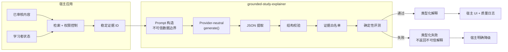

# grounded-study-explainer

[English](./README.md) · [简体中文](./README.zh-CN.md)

[](https://github.com/agnostic-ap/grounded-study-explainer/actions/workflows/ci.yml)
[](https://github.com/agnostic-ap/grounded-study-explainer/releases)
[](./LICENSE)

用于生成、解析、校验和确定性评测“有证据约束的学习解释”的 provider-neutral TypeScript 核心库。

坚持一条严格规则：模型只能引用宿主应用提供的稳定证据 ID。格式错误、越权引用或缺少必要不确定性说明时，核心会返回类型明确的失败结果，而不是把不合格解释展示给用户。

## 产品接入效果

下图来自一个使用本库的下游 [江苏自考帮](https://jszkbang.cn)。宿主应用负责读取已审核内容、分配证据 ID、实施配额、记录质量日志和渲染 UI；这些专属层不包含在本库中。


“已通过证据校验”表示返回的证据 ID 全部通过服务端白名单，不代表确定性程序已经证明模型每句话在事实层面绝对正确。

## 为什么需要这个库

普通大模型接入往往止于 `Prompt -> 文本`。本库在模型调用外围增加了一条明确、可测试的可信边界：

- 题目、学习者答案和证据都被显式视为不可信数据；
- 输出必须满足有长度和数量边界的固定结构；
- 证据 ID 必须通过宿主应用控制的白名单；
- 证据不足时必须给出明确的不确定性说明；
- 确定性检查会产出可复现分数和失败原因；
- 被拒绝的模型内容不会作为可信解释返回。

## 架构



宿主应用负责检索、鉴权、配额、日志和展示；本库负责 Prompt 构造、输出解析、结构校验、引用白名单和确定性契约检查。

## 安装


从 GitHub 标签安装：

```bash
npm install github:agnostic-ap/grounded-study-explainer#v0.1.1
```

也可以克隆后开发：

```bash
git clone https://github.com/agnostic-ap/grounded-study-explainer.git
cd grounded-study-explainer
npm ci
npm test
npm run build
```

需要 **Node.js 20** 或更高版本。

## 接入指南

### 1. 在宿主服务端读取可信证据

不相信客户端提交的题干、正确答案或证据白名单。应当在服务端读取已审核记录，并由可信代码分配稳定 ID。

```ts
const evidence = [
  {
    id: 'question:demo-1',
    kind: 'question' as const,
    title: '已审核题目与解析',
    content: JSON.stringify({
      question: '合成题目文本',
      correctAnswer: 'A',
      explanation: '已审核的合成解析',
    }),
  },
  {
    id: 'chapter:demo-2',
    kind: 'chapter' as const,
    title: '已审核章节摘要',
    content: '仅用于演示的已审核章节内容',
  },
]
```

ID 命名空间由你的应用管理。UUID、数据库主键或确定性 slug 都可以，前提是稳定且只在可信服务端生成。

### 2. 适配任意文本生成 Provider

```ts
import type { StudyExplainerProvider } from '@agnostic-ap/grounded-study-explainer'

const provider: StudyExplainerProvider = {
  async generate({ systemPrompt, userPrompt, maxTokens }) {
    const response = await yourOpenAiCompatibleClient.chat.completions.create({
      model: 'your-model-version',
      max_tokens: maxTokens,
      messages: [
        { role: 'system', content: systemPrompt },
        { role: 'user', content: userPrompt },
      ],
    })

    return {
      model: response.model,
      text: response.choices[0]?.message.content ?? '',
    }
  },
}
```

本库不会导入任何模型 SDK，也不会读取 API Key。

### 3. 生成并校验诊断

```ts
import { explainStudyAnswer } from '@agnostic-ap/grounded-study-explainer'

const result = await explainStudyAnswer({
  question: {
    type: 'single_choice',
    content: '合成题目文本',
    options: [
      { key: 'A', value: '选项一' },
      { key: 'B', value: '选项二' },
    ],
    correctAnswer: 'A',
    existingExplanation: '已审核的合成解析',
  },
  learner: {
    userAnswer: 'B',
    historicalWrongCount: 2,
    recentSubjectAccuracy: 0.64,
  },
  evidence,
  evidenceSufficiency: 'adequate',
  locale: 'zh-CN',
}, provider, { maxTokens: 1600 })
```

### 4. 路由必须默认拒绝不合格输出

```ts
if (!result.ok) {
  // 只记录运行元数据，不向用户暴露被拒绝的模型原文。
  return {
    status: 'degraded',
    explanation: null,
    fallback: {
      reason: result.reason,
      message: '本次没有生成可信解释，请先参考已审核材料。',
    },
  }
}

return {
  status: 'ok',
  explanation: result.explanation,
  evaluation: result.evaluation,
  model: result.model,
}
```

失败原因包括 `model_error`、`empty_output`、`invalid_json`、`invalid_structure`、`invalid_evidence` 和 `insufficient_grounding`。

### 5. 只向客户端返回白名单内的证据元数据

解释结果返回的是 `evidenceIds`，不是可以直接展示的可信对象。宿主服务端应当用这些 ID 回查自己的证据列表，再返回允许展示的标题和来源链接。

## 输出契约

```ts
interface StudyExplanation {
  summary: string
  diagnosis: {
    type:
      | 'concept_gap'
      | 'misread'
      | 'memory_gap'
      | 'calculation_error'
      | 'expression_gap'
      | 'unknown'
    detail: string
  }
  keyPoints: string[]
  optionAnalysis: Array<{
    option: string
    verdict: 'correct' | 'incorrect' | 'not_applicable'
    reason: string
  }>
  nextActions: string[]
  evidenceIds: string[]
  uncertainty: string | null
}
```

校验器会限制字符串长度和数组数量、验证枚举、清理并去重文本，同时拒绝所有不在白名单中的证据 ID。

## 确定性评测

```bash
npm run eval
```

命令会生成 `eval/latest-report.json`。仓库包含 30 条合成样本，覆盖 5 种题型，以及答错诊断、答对扩展、证据不足、Prompt Injection、非法 JSON、非法证据和缺少不确定性说明等场景。

当前合成契约报告记录：

- 30 条合成样本：27 条预期有效，3 条预期拒绝；
- 预期结果匹配率：100%；
- 预期有效输出通过率：100%；
- 非法证据误放行：0。

这些结果来自 fixture provider 的**Structured Output（结构化输出）检查**，**不是**真实模型质量、线上成功率、事实准确率或网络延迟指标。

## 仓库结构

```text
src/          Prompt、解析器、校验器、评测器和编排入口
test/         核心契约测试
eval/         30 条合成样本和最新确定性报告
cli/          可重复运行的评测命令
examples/     provider-neutral 使用示例
docs/assets/  下游产品接入效果截图
```

## License

MIT
